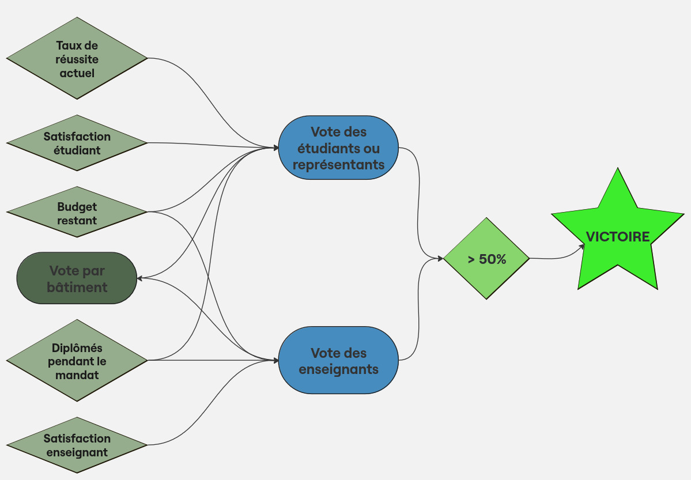

# T3 - RenovIUT

- Nom du groupe : Coruscant
- Membres du groupe : [Yasmine CHETTATI](https://git.unistra.fr/ychettati), [Elena FRISON](https://git.unistra.fr/e.frison), [Martin FRISON](https://git.unistra.fr/martin.frison).

	[Adrien AKGUL](https://git.unistra.fr/aakgul) a également contribué au projet à ses débuts.

## Présentation du projet

Vous incarnez le directeur de l'IUT Robert Schuman qui, souhaitant se faire réélire, intervient sur le campus d'Illkirch pour assurer des réparations d'urgence - sans pour autant négliger les rénovations planifiées des bâtiments.

### Captures d'écran

<small>Fig.1. Fenêtre principale</small>

<small>Fig.2. Informations liées à un bâtiment</small>

<small>Fig.3-5. Notifications</small>

### Installation et exécution

Pour lancer le jeu, il suffit de ... _SECTION À REMPLIR_

## Cahier des charges

### Objectifs pédagogiques généraux
En tant que _[serious game](#jeux-sérieux)_, RenovIUT ne se limite pas à vous divertir, mais a également des objectifs pédagogiques, à savoir :

- **_Comprendre_** le rôle du directeur de l'IUT, établissement à une administration relativement autonome, dans l'entretien et la rénovation de ses locaux, en adéquation avec ses engagements sociaux ;
- **_Découvrir_** les bonnes pratiques de gestion du budget d'un IUT, alimenté de sources de financement certes multiples mais limitées, afin d'assurer les meilleurs conditions de travail possibles pour ses étudiants et son corps enseignant ;
- **_Expérimenter_** la prise de décision en situation d'urgence, nécessitant une remise en question des priorités de l'établissement.

### Objectifs pédagogiques avancés

Sur un mandat de 5 ans, vous devez rénover les bâtiments et les infrastructures, [en gérant votre budget partagé entre les dépenses d'énergie, les salaires et les rénovations](#missions) et [en répondant aux aléas qui se présentent](#aléas). Comme [le budget](#budget) est limité et que le temps passe vite, il va falloir faire des [choix](#actions-du-joueur) !

Votre objectif ultime est de vous faire [réélire](#scénarios) à la fin du mandat. Pour ce faire, vous devrez maintenir de bonnes conditions de travail et veiller à la satisfaction des étudiants et des enseignants.

La problématique du jeu se construit autour de quatre éléments :

1. **_Les infrastructures existantes_** qui doivent être entretenues voire, à moment donné, réparées.

	- Évaluer l'état actuel des bâtiments et des installations
	- Concevoir un plan de rénovation
	- Assurer la coordination des parties prenantes

2. **_Le budget_**, le pivot des activités, car aucune intervention sur le campus n'est possible sans financement.

	- Élaborer un bugdet réaliste
	- Rechercher des sources de financement multiples
	- Assurer le suivi financier des projets

3. **_Les parties prenantes_**, qui sont avant tout les étudiants, mais aussi les enseignants, les personnels, l'Eurométropole...

	- Assurer une communication transparente avec tous les acteurs et parties prenantes
	- Veiller à la satisfaction des étudiants et des enseignants
	- Mettre en place des mécanismes d'amélioration continue

4. **_Les aléas_**, des imprévus suffisamment nombreux pour que vous soyez encore surpris en en devant confronter un !

	- Identifier les problèmes prioritaires
	- Apporter des réponses rapides et adéquates
	- Faire face aux cas de force majeure

####  Références
##### Rénovations réalisées dans différents IUT :

- https://savoirs.unistra.fr/campus/les-locaux-du-departement-genie-civil-construction-durable-de-liut-robert-schuman-inaugures
- https://iutrs.unistra.fr/iut/historique
- https://www.univ-tln.fr/Projet-IUT-RENOV-premiere-etape-dans-la-renovation-du-campus.html
- https://iut-nancy-brabois.univ-lorraine.fr/renovation-energetique/
- https://fr.wikipedia.org/wiki/R%C3%A9novation_%C3%A9nerg%C3%A9tique

##### Jeux sérieux :

- https://larevuedesmedias.ina.fr/les-serious-games-un-objet-en-construction
- https://fr.wikipedia.org/wiki/Jeu_s%C3%A9rieux
- http://serious.gameclassification.com/FR/index.html

### Description des fonctionnalités

#### Simulation

**_Le pas de la simulation est d'une année._**

- Bien que l'IUT fonctionne avec le contrôle continu, la décision du jury concernant le passage de l'étudiant à l'année suivante ne se fait qu'à la fin de l'année.
- Pour rappeler que la gestion d'un établissement éducatif se fait souvent dans l'urgence, le _gameplay_ est extrêmement rapide : en une minute, le directeur de l'IUT incarné par le joueur est censé réagir à toutes les sollicitations d'une année.
- Comme dans la vraie vie, il n'arrivera sans doute pas à répondre à toutes, les problèmes non résolus affectant les paramètres du jeu et souvent, diminuant ses chances d'être réélu.e.

**_À la fin de chaque année, le nombre d'étudiants et, par conséquent, celui d'enseignants est susceptible de changer._**

- Des étudiants peuvent être exclus à cause de leurs mauvais résultats - qui sont fonction de leur niveau de départ, de leur sérieux et d'un peu de chance.
- D'autres étudiants encore partiront de leur propre gré, parce qu'ils ne sont pas satisfaits de l'établissement (y compris des conditions de travail qu'il propose) ou pour des raisons personnelles (aléatoires).
- Le nombre d'enseignants suit le nombre d'élèves : si les effectifs étudiants connaissent une baisse trop importante, quelques enseignants seront obligés de partir, et inversement, une surpopulation des étudiants entraîne des recrutements d'enseignants. À noter toutefois que, contrairement aux fluctuations annuelles du nombre d'étudiants, le nombre d'enseignants change par paliers, en fonction de quelques valeurs de seuil.

**_À la fin de chaque année, différents calculs sont réalisés._**

Plusieurs paramètres décrivant le campus changent d'une année à l'autre :

- **_L'état des bâtiments_**. Résulte de leur âge, de leur état au début de l'année, ainsi que, bien entendu, des réparations qui auront été réalisées (moyennant un budget, et donc fonction de ce budget - mais aussi de la qualité de prestation fournie par l'entreprise qui réalise les travaux).
- **_Le bugdet octroyé_**. Il dépend des financements obtenus (de différentes catégories), des besoins de l'Institut, des revendications syndicales, éventuellement des cas de force majeure... Il est demandé par le directeur, mais c'est le Conseil d'administration qui a le dernier mot.
- **_Le taux de satisfaction_**. Il est calculé séparément parmi les étudiants et les enseignants, par bâtiment mais aussi pour l'ensemble des départements de l'IUT Robert Schuman ;
- **_Le taux de réussite_**. Ne concerne que les étudiants et dépend de la satisfaction de ces derniers, mais aussi de leur niveau (partie déterministe) et de la chance qu'ils auront eu, à l'Institut ou en dehors (partie aléatoire).

##### Budget

L'IUT Robert Schuman étant un établissement public, ses principales sources de financement sont des **_subventions publiques_**, provenant notamment de :

- l'État ;
- la région Grand Est ;
- l'Eurométropole de Strasbourg ;
- l'Université de Strasbourg (l'IUT en fait certes partie administrativement, mais cela reste deux entités distinctes).

Des **_financements privés_** peuvent être tout aussi importants, à savoir des fonds :

- issus de partenariats avec des entreprises ;
- faisant objet de dons de particuliers, d'anciens élèves ou d'organisations qui souhaitent contribuer au développement de l'IUT.

Viennent s'y rajouter quelques sources moins importantes, qui ne peuvent être que **_complémentaires_** :

- frais de scolarité des étudiants (bien qu'ils soient faibles dans un État social qu'est la France) ;
- utilisation d'infrastructures de l'IUT par d'autres organismes (par exemple, une école privée dont les élèves viennent manger au Resto U et utiliser l'aire de remise en forme, aménagée sur le campus).

##### Missions

Il est essentiel de prévoir un entretien régulier ainsi que des réparations et rénovations des bâtiments et des infrastructures de l'IUT pour garantir des conditions de travail et d'apprentissage optimales. À travers les missions affichées sous forme de notifications, RenovIUT vous permet de découvrir différents types de travaux de routine :

- Un **_entretien préventif_** permet de détecter et de résoudre rapidement les problèmes, évitant ainsi des pannes majeures et des coûts de réparation plus élevés :
		- maintenance des systèmes de chauffage, ventilation et climatisation (CVC)
		- inspection des installations électriques
		- inspection de plomberie.
- Les **_réparations_** peuvent concerner :
		- revêtements de sol
		- fenêtres et portes
		- équipements endommagés
- Quant aux **_rénovations_**, elles peuvent impliquer la modernisation de :
		- salles de classe
		- laboratoires
		- espaces communs, pour répondre aux besoins pédagogiques contemporains et améliorer l'accessibilité.

Comme les missions sont planifiées, elles sont affichées en anticipation, à la fin de l'année précédent celle des travaux.

##### Aléas

#### Interface

L'interface est constituée des éléments suivants :

- Plan du campus d'Illkirch, vue du dessus

- Affichage des informations complètes sur un bâtiment sélectionné avec un clic :
	- nom du département qui l'occupe ;
	- son âge
	- sa superficie
	- effectifs du corps enseignant et des étudiants ;
	- le niveau de satisfaction des uns et des autres ;
	- état des infrastructures :
		- isolation
		- chauffage
		- nombre d'agents d'entretien qui y interviennent

- Affichage du budget, simple montant (par bâtiment) ou composition détaillée (total du campus)

- Notifications :
	- missions courantes
	- aléas auquels le joueur doit faire face :
		- soit en prenant une décision via une fenêtre pop-up (choix multiple)
		- soit en en assumant la conséquence inévitable

- Affichage du bilan de l'année pour l'ensemble de l'IUT :
	- satisfaction étudiante et professorale ;
	- évolution du nombre d'étudiants et d'enseignants ;
	- financements prévus pour l'année prochaine ;
	- liste des rénovations planifiées accompagnées de leur coût

- Bouton pour passer à l'année suivante

- _Timeline_ pour désigner la progression dans le temps

- À la fin du mandat, écran de fin de jeu affichant le score et le résultat des élections : le président a-t-il été réélu ?

#### Actions du joueur

Le jeu consiste à répondre aux défis qui surgissent, attendus ou imprévus, en faisant des choix avisés quand on peut (il est à noter que dans certains cas de force majeure, aucune action n'est possible).

Pour ce faire, le directeur _aka_ joueur peut, concrètement :

- Valider toutes des rénovations planifiées ou seulement quelques-unes ;
- Choisir l'entreprise qui effectuera les travaux ;
- Essayer d'obtenir des financements supplémentaires ;
- Proposer au Conseil d'administration d'agrandir la surface utile - ou, au contraire, de fermer certains locaux ;
- Ajuster le calendrier de chauffage ;
- Décider d'une action spécifique ponctuelle, en choisissant dans une liste de choix proposés, généralement face à un aléa.

#### Scénarios

<small>Fig.6. Schéma du déroulement du jeu</small>

Le schéma ci-dessus résume les conditions de victoire. En effet, il faut remporter la majorité des voix d'enseignants et d'étudiants faisant partie du Conseil d'administration de l'IUT, pondérées par le nombre des uns et des autres. Les votes sont calculés par bâtiment.

À noter que dans RenovIUT, il n'y a pas de second tour, pourtant possible dans la vraie vie dans certaines situations.

Les résultats du vote résultent de plusieurs questionnements :

- pour les étudiants :
	- le taux de réussite _(s'il est trop bas, des étudiants partent et l'établissement change de carrure, et très probablement de président aussi)_.

- pour tout le monde :
	- de l'état des infrastructures _(personne n'a envie de travailler dans un bâtiment où il gèle en hiver et étouffe en été, sans matériel nécessaire ... ;)_
	- du budget restant _(un établissement qui n'a plus de moyens se pose forcément des questions sur ces responsables ;)_
	- de la satisfaction _(pas individualisée, c'est la moyenne par bâtiment puis la moyenne totale qui est prise en compte. En revanche, les étudiants peuvent être moins ou plus satisfaits que les enseignants, ces deux catégories n'étant pas forcément du même avis ;)_
	- du nombre de diplômes obtenus pendant le mandat _(présumant que les compétences des diplômés sont de haut niveau - cf. le taux de réussite, c'est un facteur non négligeable.)_

Trois niveaux de difficulté sont proposés :

- **_facile_**

	Est destiné aux débutants. Un tuto expliquant les commandes précède la partie. Les moyens de départ (état des bâtiments et des infrastructures, budget, satisfaction des étudiants et des enseignants) sont au maximum, alors que les aléas sont réduits : un défi par partie.

- **_moyen_**

	S'adresse à un joueur qui s'était déjà essayé au jeu. Ne fournit pas de tutoriel et permet de tester ses choix dans une situation un peu moins confortable, avec plusieurs aléas à la carte.

- **_difficile_**

	Les moyens initiaux sont bien limités - mais cela peut aussi arriver en dehors du jeu ! En outre, le niveau difficiel vous demande de réagir à plusieurs sollicitations urgentes au cours d'une partie.

À l'issue d'une partie :

- Soit vous êtes réélu, auquel cas vous gagnez, avec un score plus ou moins élevé ;
- Soit vous n'êtes pas réélu : ne baissez pas les bras, n'hésitez pas à recommencer si cela vous a plu !

### Contraintes de développement

Ce jeu a été développé avec le moteur [Godot Engine](https://godotengine.org/).

Le code est modularisé suivant le patron de conception [MVC](https://www.geeksforgeeks.org/mvc-design-pattern/), tout en respectant l'organisation d'un projet Godot :

- Les vues, les contrôleurs et les modèles se trouvent dans les répertoires dédiés `views/`, `controllers/` et `models/`, respectivement.
- Les **_vues_** sont scindées en `scenes/` et `nodes/`.
- Les **_contrôleurs_** assurent le traitement des données et le déroulement du jeu.
- Les **_modèles_** sont indépendants et ne sont que consultés par les vues (i.e. l'interface utilisateur) et modifiés par les contrôleurs (i.e. la logique du jeu).
- Les **_données_** sont stockées dans des tables SQL (_TeacherSQLTable_, _StudentSQLTable_, _FundSQLTable_ et _NotificationSQLTable_).

### Fonctionnalités et scénarios avancés

Fonctionnalités implémentées :

- a
- b
- c

Fonctionnalités à implémenter :

- a
- b
- c
